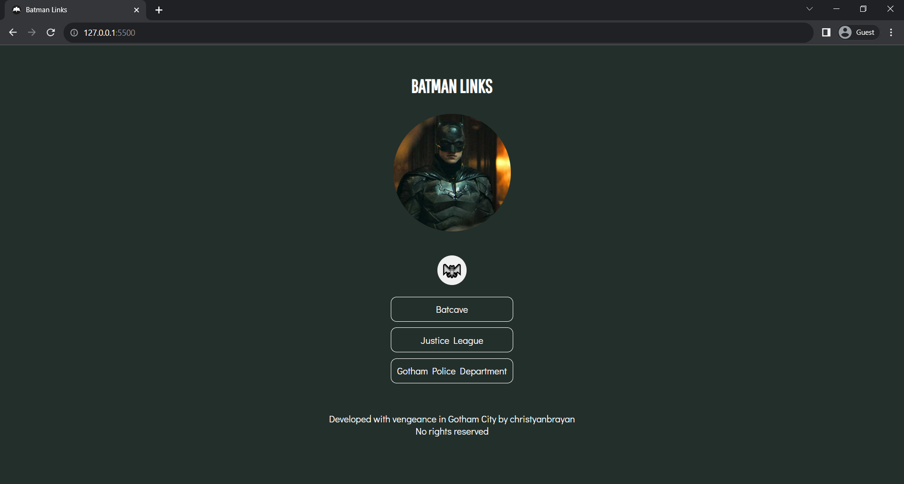

# 🦇 👔

This is a simple website to pratice HTML, CSS and JS.

It's a landing page with Batman links (like a Linktree), that when clicks the button switches to "Bruce mode" (yes, a joke~~r~~ with light and dark mode).

It's currently still in development, but whenever you can contribute ideas or direct code, you're free to fork and open issues and PRs. (I'm learning, so something is probably wrong and you can help me fix it).

It is currently still in development, but you are welcome to contribute ideas or code at any time, forking and opening issues and PRs (I'm learning, so there's probably something wrong and you can help me fix it).

---

* **HTML**
* **CSS**
* **Vanilla JavaScript**
* **Hosted with GitHub Pages**
* **Favicon images: [AutoDraw](https://www.autodraw.com/)**

---

Developed with vengeance in Gotham City by [christyanbrayan](https://github.com/christyanbrayan)